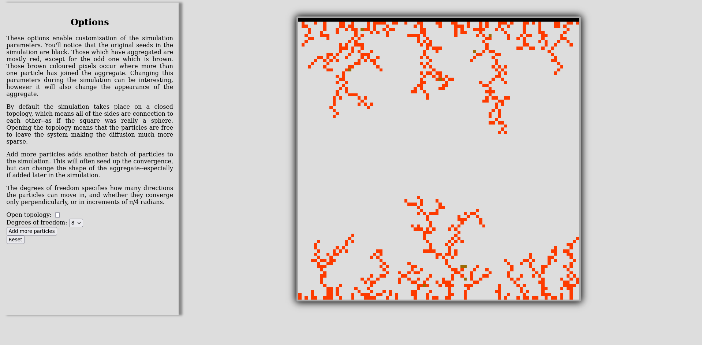

# Diffuse Limited Aggregation Simulator
This app simulates 2D diffusion limited aggregation on open or closed 
topologies using random walks to generate Brownian trees.  

Diffusion limited aggregation occurs when randomly moving particles cluster together 
into aggregates forming (in simulations) 2D fractals.  



## Technologies used
Node, Express, JavaScript, EJS/HTML, and CSS.  

## To run
clone the repository and navigate to it.  Edit config/.port if you're inclined to change the port
`PORT=3000` or any other port you wish to use.  If desired, you can also edit the row and col
in controllers/home.js to change the simulation granularity, save any changes and run:

```bash
npm install
npm start
```

Navigate to [http://localhost:3000](http://localhost:3000) replace the port with the one you chose.

## Improvements
Improved efficiency to reduce rendering load, allowing for larger simulations with more particles.

Generalized functions to enable users to setup and interact with simulations.  

Improved width and height setting to allow dynamic resizing of pixels based on simulator size.
